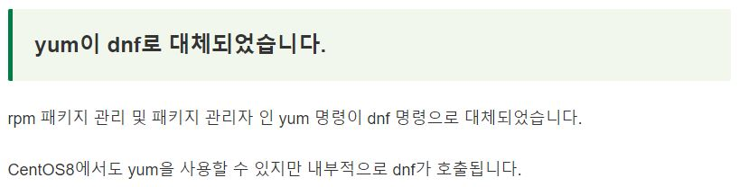
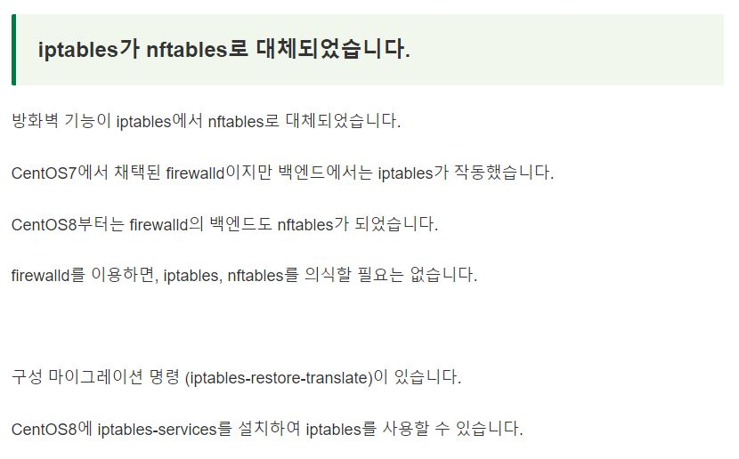
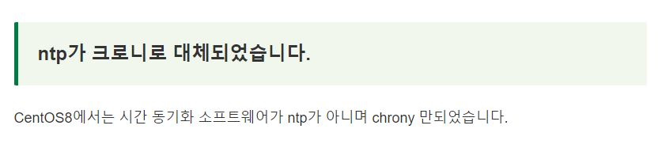
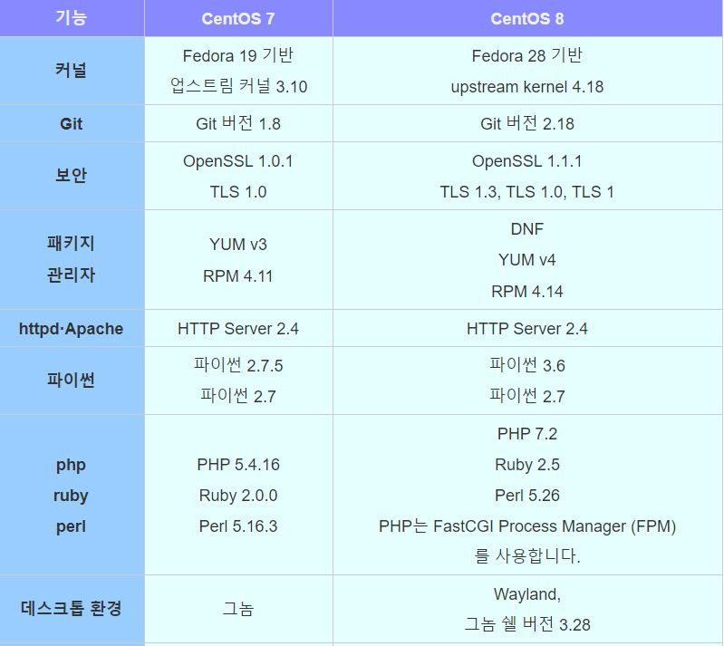
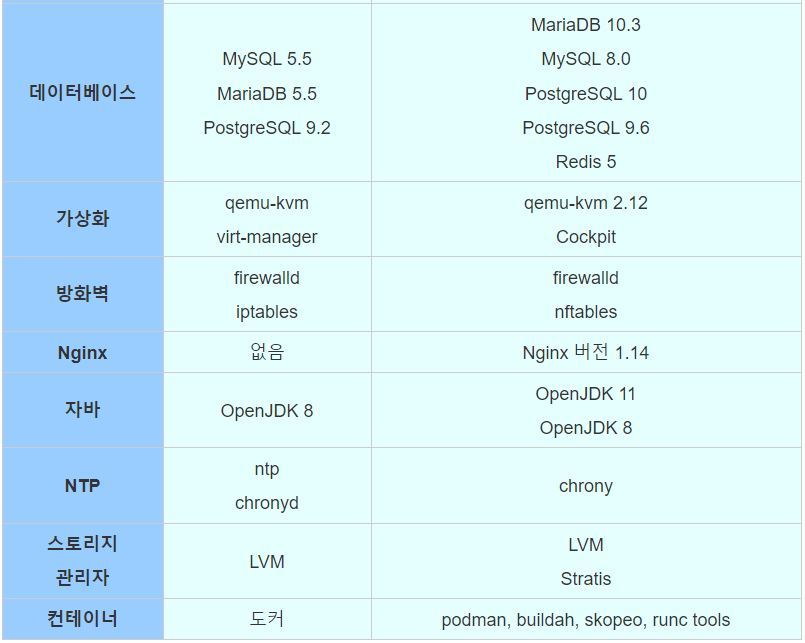
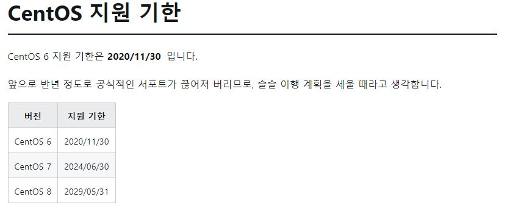
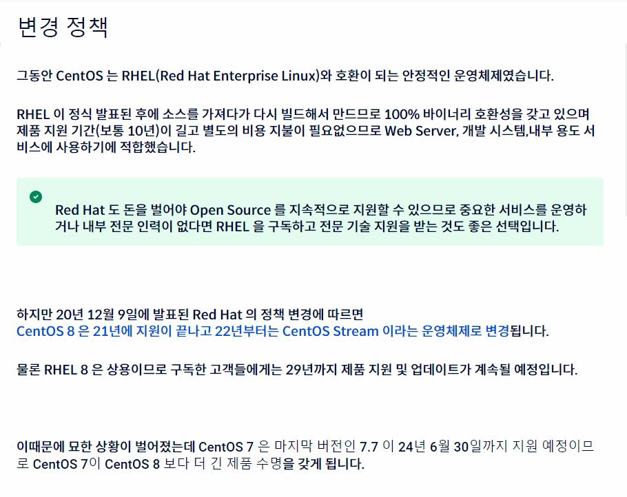
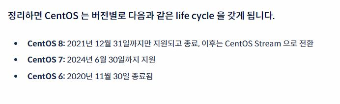

# CentOS 7 VS CentOS 8

# 목차
1. 주요 차이점
2. CentOS 7과 Centos 8의 차이, 변경점, 비교표
3. Centos 7,8 출시일
4. Centos 지원 기한
5. CentOS 8 지원 종료 및 CentOS Stream 전환
6. CentOS를 대체할수 있는 OS
7. 참조사이트
# #주요 차이점

### 1. centos 8에서는 yum보다 강력한 DNF를 사용할수 있게 되었습니다.

### 2. firewalld의 백앤드가 변경되었습니다

### 3. 시간 동기화 소프트웨어 ntp가 chrony로 대체되었습니다

## #주요 차이점 변경 표
||centos 7|centos 8|
|---|---|---|
|패키지 관리자|Yum v3, RPM 4.11|DNF, YUM v4, RPM 4.14|
|NTP|ntp, chronyd|chronyd|
|방화벽|firewalld, iptables|firewalld, nftables|
***
# #CentOS 7과 Centos 8의 차이, 변경점, 비교표
> 참조: https://urashita.com/archives/34213

### <mark>**해당 버전은 CentOS를 깔았을때 기본으로 생기는 버전이며 추후 업데이트를 할수 있다**</mark>
> 참조 : https://websetnet.net/ko/how-to-install-php-7-2-on-centos-7/
***

# #Centos 7,8 출시일
> 참조 : https://ko.wikipedia.org/wiki/CentOS
* <b>CentOS 7</b>: 2014년 7월 7일
* <b>CentOS 8</b>: 2019년 9월 24일

# #Centos 지원 기한
> 참조 : https://dev.classmethod.jp/articles/centos6-centos8_matome/

# #CentOS 8 지원 종료 및 CentOS Stream 전환
> 참조 : https://www.lesstif.com/lpt/centos-8-centos-stream-98927171.html
 
> 참조2 : https://changwoo.xyz/hacks/2020/12/09/end-of-centos.html

## <mark><b>개발용의 경우는 지원 종료와 크게 관계 없음</b></mark>
> 참조 : https://www.sharedit.co.kr/qnaboards/23980

# #CentOS를 대체할수 있는 OS
1. <b>Rocky Linux</b>
>참조 : https://velog.io/@dojun527/Rocky-Linux-%EC%84%A4%EC%B9%98
2. <b>Oracle Linux</b>
>참조 : https://www.oracle.com/kr/linux/

# #참조사이트
1. https://computingforgeeks.com/centos-7-vs-centos-8-feature-comparison/
2. https://dev.classmethod.jp/articles/centos6-centos8_matome/
3. https://urashita.com/archives/34213
4. https://websetnet.net/ko/how-to-install-php-7-2-on-centos-7/
5. https://ko.wikipedia.org/wiki/CentOS
6. https://www.lesstif.com/lpt/centos-8-centos-stream-98927171.html
7. https://www.sharedit.co.kr/qnaboards/23980