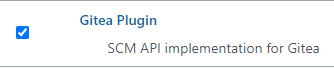
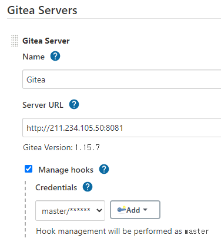
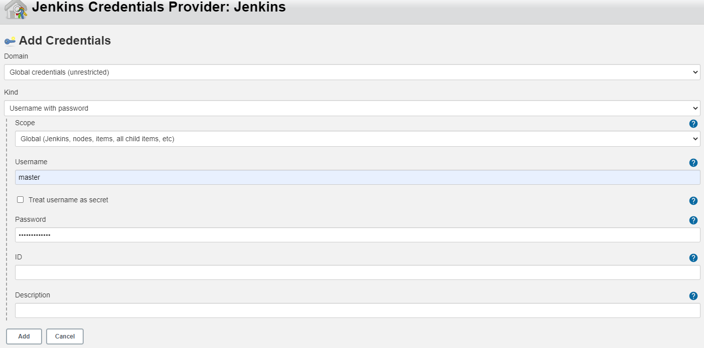
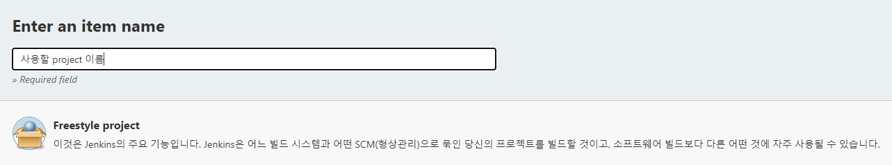
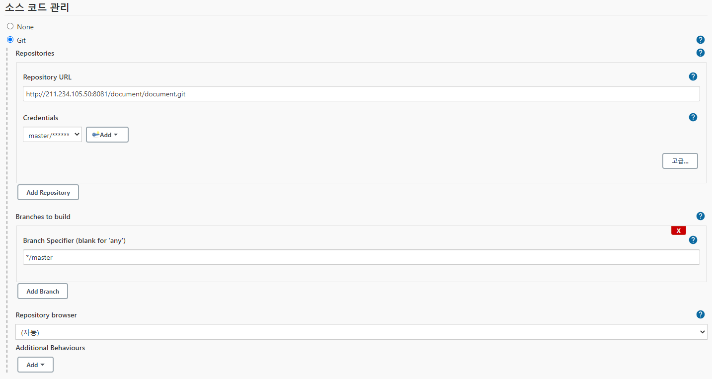
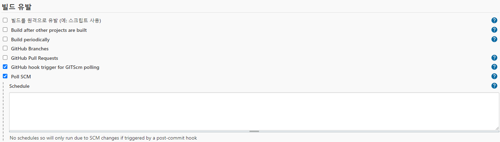
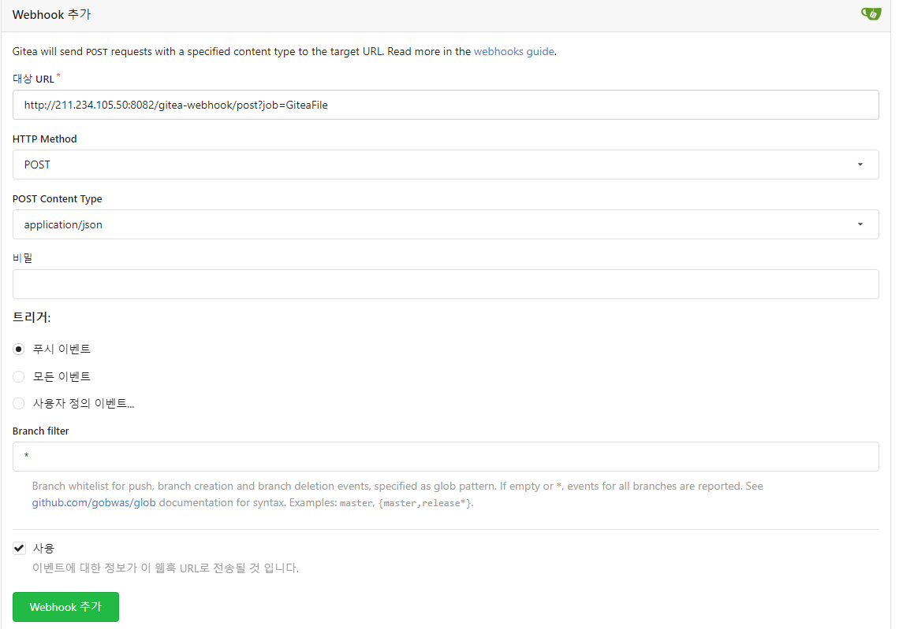
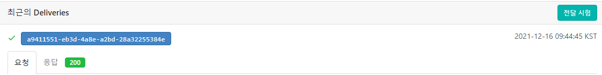

# Gitea와 Jenkins WebHook 연결 
> Gitea와 Jenkins를 webhook으로 연결하여 gitea에서 push 할 경우 자동 빌드를 하도록 구성하겠습니다.

## 1. Jenkins 플러그인에서 Gitea 플러그인 설치
> 좌측 메뉴 Jenkins 관리 > 플러그인 관리 > 설치 가능 검색 Gitea > 다시시작 하지 않고 설치

   
   

## 2. Jenkins에 Gitea 서버 등록
> 좌측 메뉴 Jenkins 관리 > 시스템설정 > Gitea Servers 설정 > Apply > 저장

   
   
- **name** : 사용할 명칭 
- **Server URL** : Gitea 서버 접속 주소 
- **Manage hooks** 체크
- **Credentials**   
   
- **kind** : Username with password (다른 방법으로 해도 무관)
- **Username** : Gitea 유저명
- **Password** : Gitea 유저명의 비밀번호
- **ID** : Jenkins 내부에서 인식할 id (지정 안해줘도 자동 설정)

## 3. Jenkins job 생성
> 좌측 메뉴 새로운 Item > Freestyle project > 소스 코드 관리 > 빌드 유발 > Apply > 저장

   
   
- **소스 코드 관리** : Git 선택
- **Repository URL** : Gitea 저장소 URL (SSH로 할 경우 따로 설정을 더 해야 가능)
- **Credentials** : 이전 생성 방법과 동일 (이미 생성되 있다면 생성된것으로 사용)   

※ 이외의 것은 따로 건드리지 않습니다.

   
- GitHub hook trigger for GITScm polling, Poll SCM 체크

## 4. Gitea Webhook 등록
> 저장소 설정 > 웹훅 > Webhook 추가 > 드롭다운 메뉴 Gitea 선택

   
- **대상 URL** : jenkins주소/gitea-webhook/post?job=프로젝트이름   
   
- 하단의 전달 시험 후 초록색으로 체크가 되면성공
- 이후 gitea로 푸쉬하면 자동 빌드 진행

