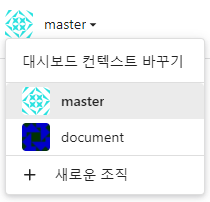

# Gitea 저장소 만들고 local에 연결하여 push 및 pull 

## 목차
1. 저장소 생성
2. 로컬에서 Gitea 원격 저장소 연결
3. Pull과 Push
4. 권한 부여 (팀원추가)
5. 조직 생성

## 1. 저장소 생성
우선 로그인 한 뒤 메인화면의 저장소에서 + 버튼을 누릅니다.   

   
branch/master/메뉴얼/Gitea/img/repo.PNG
이후 저장소 설정 화면에서 소유자는 개인 또는 조직으로 설정이 가능합니다.   
저장소의 이름에 한글작성은 불가능합니다.   

   

하단의 저장소 만들기를 누르고 나면 다음과 같은 화면이 나타납니다.   

   

## 2. 로컬에서 Gitea 원격 저장소 연결
저장소 생성 이후 본인이 해당 저장소의 git 디렉토리로 사용할 폴더로 이동합니다.

   

사용할 폴더에서 git init을 통해 .git을 생성하여 해당 디렉토리를 git 디렉토리로 설정합니다.   
이후 git remote add (사용할이름) (ssh 또는 http 주소)를 통해 remote를 생성합니다.   
그리고 git remote -v를 통해 생성된 remote를 확인할 수 있습니다.

## 3. Pull과 Push
> Pull하는 방법과 Push 하는 방법에 대해 알아보겠습니다.

### 3-1. Pull
   
remote 생성 이후 바로 git pull (remote이름) (branch이름)을 하면 에러가 발생합니다.   
<mark>에러 발생 원인은 현재 저장소에 아무런 폴더 및 파일이 없기 때문입니다.</mark>   
원인을 해결하기 위해선 먼저 push를 하여 저장소에 데이터를 넣어줍니다.

### 3-2. push 
테스트를 위해 exam.txt파일을 example 폴더에서 만들고 진행하였습니다.   
   

git add (파일이름 또는 .)을 통해 단일 파일, 폴더, 디렉토리 전체를 git에 add 합니다.   
git commit -m (commit의 정보)를 통해 git에 commit 합니다.   
이후 git push (remote이름) (branch이름) 을 통해 원격 저장소에 push합니다.   

<mark>여기서 에러가 발생한 이유는 현재 원격 저장소에 접근 권한이 없기 때문입니다.</mark>   
원인은 다른 유저 또는 조직에서 만든 저장소에 push를 하려하면 공동작업자로 등록이 되어있지 않기에 push가 불가능합니다.   
다른 유저가 아닌 본인의 저장소라면 바로 push가 가능합니다.    

## 4. 권한 부여 (팀원추가)
> 원격 저장소 접근을 위한 권한부여에 관한 설명입니다.
### 4-1. 개인 원격저장소
   
다른 유저의 개인 저장소의 경우 저장소 설정 > 공동작업자 > 공동작업자 추가로 저장소를 공유할 수 있습니다.   

## 5. 조직 생성 
   
새로운 조직을 클릭합니다.   

   
조직 이름과 공개 범위를 설정후 생성합니다.

### 5-1. 조직 원격저장소
   
조직 설정을 위해 좌측 상단의 대시보드 변경을 통해 조직으로 이동합니다.   

   
가장 우측의 document보기를 클릭합니다. ※(조직도이름)보기   

   
팀 이름을 클릭하여 사용자를 검색 후 추가하거나 팀을 새로 만들어 접근 권한을 설정하고 추가할 수 있습니다.