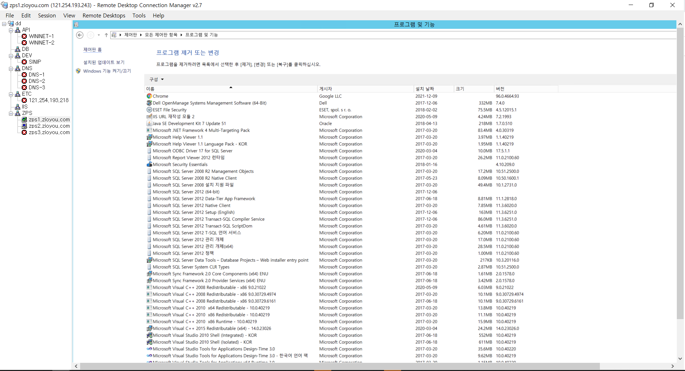
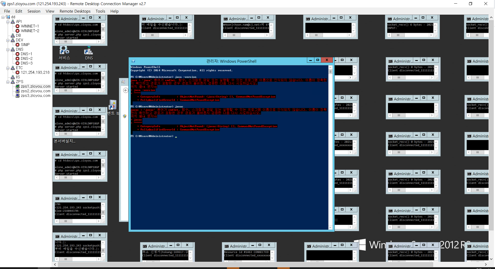
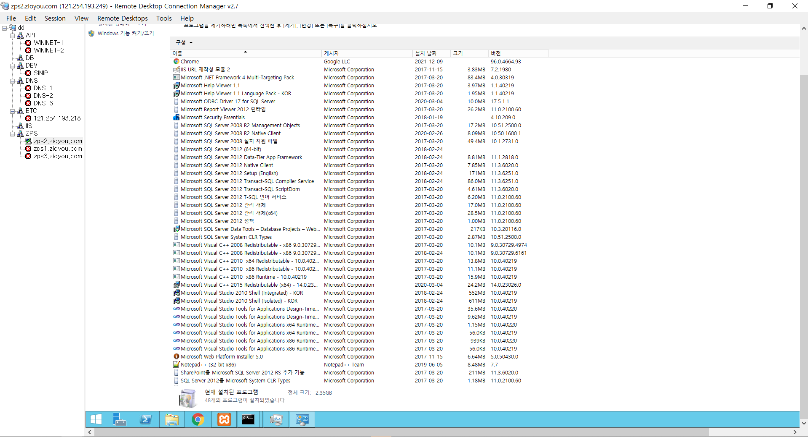
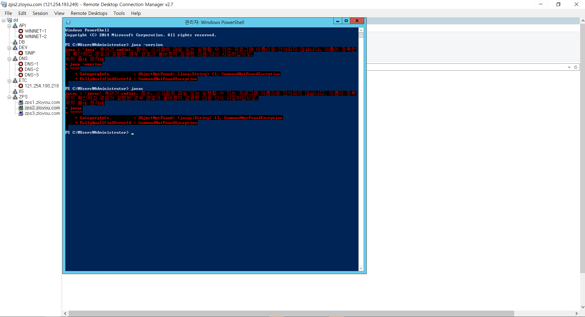
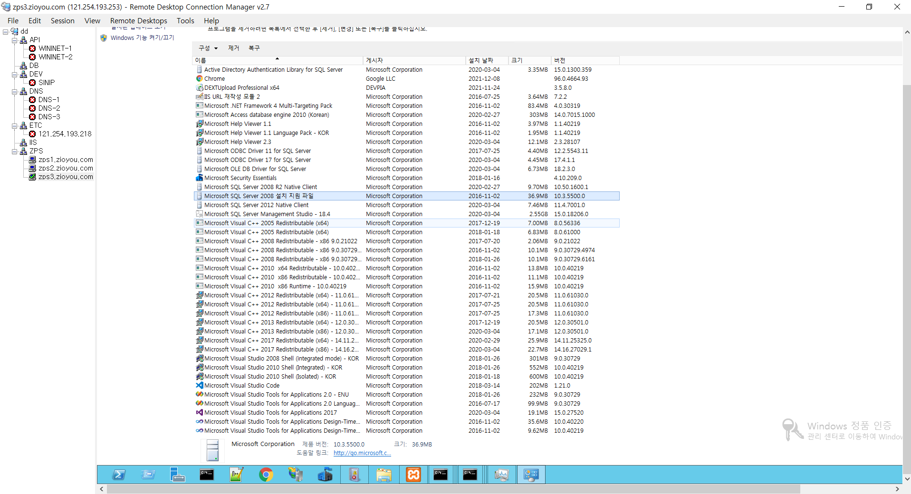
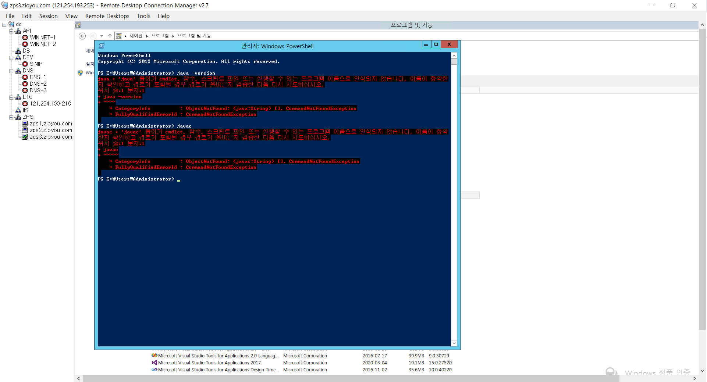

# #증상 및 현상

1. Apache Log4j 2*에서 발생하는 원격코드 실행 취약점(CVE-2021-44228)    
   
   * 프로그램 작성 중 로그를 남기기 위해 사용되는 자바 기반의 오픈소스 유틸리티

2. 영향을 받는 버전
   
   * Apache Log4j 2
   * 2.0-beta9 ~ 2.14.1 모든버전
   * Apache Log4j 2를 사용하는 제품

# #조치방법

1. 해결방안
   * 제조사 홈페이지를 통해 최신버전(2.15.0)으로 업데이트 적용
        
        ※ log4j 1.x버전 사용자의 경우 추가적인 업그레이드 지원 중지로 인해 다른 보안위협에 노출될 가능성      이 높아 최신버전 업데이트 적용 권고
   
   * 최신버전으로 업데이트가 어려운 경우 사용중인 버전확인 후 버전별 조치 적용 (버전확인방법)

2. log4j가 설치된 경로의 "pom.xml"파일을 열어 "log4j"로 검색
3. 검색결과 "사용버전(version)" 확인가능
  - (조치방법) 2.0-beta9 ~ 2.10.0
     ※ JndiLookup 클래스를 경로에서 제거 : 
     zip -q -d log4j-core-*.jar org/apache/logging/log4j/core/lookup/JndiLookup.class
  - (조치방법) 2.10 ~ 2.14.1
      ※ log4j2.formatMsgNoLookups 또는 LOG4J_FORMAT_MSG_NO_LOOKUPS 환경변수를 true로 설정

# #그룹웨어 확인방법

    1. apache 설치 여부
    2. JDK 설치 여부
    3. java framework (maven,sping,jsp 등) 사용 여부

# #그룹웨어 확인사항

    1. apache 실행 서버
   
        * 닥스클라우드
        * zps1.zioyou.com
        * zps2.zioyou.com
        * zps3.zioyou.com

    2. log4j.jar 를 사용하는 apache 서버 없음
    
    3. JDK를 설치 서버 없음

    4. java framework (maven,sping,jsp 등)를 사용하는 프로젝트 없음
    
    5. apache 웹서버의 경우 로그 생성 시 log_config_module를 사용하며 해당 모듈은 이슈내용에 포함되지 않는 사항임.
 
# #결론
<mark> 이번 증상의 원인이 되는 log4j의 경우 java framework (maven,sping,jsp 등)에서 jar파일을 임포트하여 적용하기 때문에 현 그룹웨어에서 조치하지 않아도 된다고 판단됨.</mark>

# #그룹웨어 확인 자료

(zp1.zioyou.com 설치프로그램)  

(zp1.zioyou.com JDK 설치 여부)  

(zp2.zioyou.com 설치프로그램)  

(zp2.zioyou.com JDK 설치 여부)  

(zp3.zioyou.com 설치프로그램))  

(zp3.zioyou.com JDK 설치 여부)  

## 참고사이트
* https://www.krcert.or.kr/data/secNoticeView.do?bulletin_writing_sequence=36389
* https://indiakim.tistory.com/436
* https://redcoder.tistory.com/256