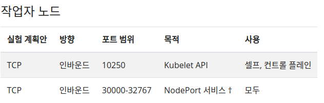

# Kubernets Slave Node 설치

## 문서 정보
> Kubernets Slave Node 설치 메뉴얼

## 목차
1. [포트 설정]()
2. [iptables 설정]()
3. [SELinux 해제]()
4. [Swap Off]()
5. [도커 설치]()
6. [저장소 업데이트]()
7. [Kubeadm, Kubelet, Kubectl 설치]()
8. [환경설정]()
9. [네트워크 (애드온) 플러그인 설치 (Callico)]()
10. [Master Node에 연결]()
 
## 1. 포트 설정

```cmd
sudo firewall-cmd --add-port 10250/tcp --permanent
sudo firewall-cmd --add-port 30000-32767/tcp --permanent
sudo firewall-cmd --reload
```

   

## 2. iptables 설정

```cmd
cat <<EOF | sudo tee /etc/sysctl.d/k8s.conf
net.bridge.bridge-nf-call-ip6tables = 1
net.bridge.bridge-nf-call-iptables = 1
EOF
sudo sysctl --system
```

## 3. SELinux 해제

> 컨테이너가 Pod 네트워크의 host filesystem 액세스 할 수 있도록 하기위해 SELinux 해제를 한다.

```cmd
sudo setenforce 0
sudo sed -i 's/^SELINUX=enforcing$/SELINUX=permissive/' /etc/selinux/config
```

## 4. Swap Off

> 쿠버네티스에서 Swap Memory 사용 시 속도가 저하된다

```cmd
sudo swapoff -a
sudo sed -i
```

## 5. 도커 설치

### 5.1 yum 업데이트
```cmd
yum -y update
```

### 5.2 Docker Repository 등록

```cmd
sudo dnf config-manager --add-repo=https://download.docker.com/linux/centos/docker-ce.repo
sudo dnf list docker-ce
```

### 5.3 Docker 설치

```cmd
sudo dnf install docker-ce --nobest -y
```

### 5.4 Docker 버전 확인

```cmd
docker -v
```

### 5.5 Docker 상태 확인

```cmd
systemctl status docker.service
```

### 5.6 시스템 부팅시 Docker자동시작 등록

```cmd
systemctl enable docker
```

### 5.7 Docker 실행

```cmd
systemctl start docker
```

### 5.8 Docker 상태 확인

```cmd
systemctl status docker.service
```

### 5.9 Docker 중지

```cmd
systemctl stop docker
```

## 6. 저장소 업데이트 

```cmd
cat <<EOF | sudo tee /etc/yum.repos.d/kubernetes.repo
[kubernetes]
name=Kubernetes
baseurl=https://packages.cloud.google.com/yum/repos/kubernetes-el7-\$basearch
enabled=1
gpgcheck=1
repo_gpgcheck=1
gpgkey=https://packages.cloud.google.com/yum/doc/yum-key.gpg https://packages.cloud.google.com/yum/doc/rpm-package-key.gpg
exclude=kubelet kubeadm kubectl
EOF
```

## 7. Kubeadm, Kubelet, Kubectl 설치

> Kubeadm : 클러스터를 Bootstrap 해주는 명령<br>
> Kubelet : 클러스터의 모든 머신에서 실행되고 Pod 및 Container 시작과 같은 작업을 수행하는 구성 요소<br>
> kubectl: 클러스터와 통신하기위한 Command Line 유틸리티<br>

```cmd
sudo yum install -y kubelet kubeadm kubectl --disableexcludes=kubernetes
sudo systemctl enable --now kubelet
```

## 8. 환경설정

> kubectl 명령을 사용하기 위함

```cmd
mkdir -p $HOME/.kube
sudo cp -i /etc/kubernetes/admin.conf $HOME/.kube/config
sudo chown $(id -u):$(id -g) $HOME/.kube/config
```

>추가로 kube 환경설정 파일을 환경변수로 지정할 수 있다.

```cmd
export KUBECONFIG=/etc/kubernetes/admin.conf
```

## 9. 네트워크 (애드온) 플러그인 설치 (Callico)

>이 상태로는 파드가 서로 통신하지 못한다. 따라서 네트워크 플러그인을 워커노드에 설치를 해줘야 한다. 플러그인 중 Callico 라는 플러그인을 사용한다

```cmd
curl https://docs.projectcalico.org/manifests/calico.yaml -O
kubectl apply -f calico.yaml
```
 
## 10. Master Node에 연결

```cmd
kubeadm join 192.168.56.11:6443 --token o0zezq.d3a298ky1xqdyz15 \
    --discovery-token-ca-cert-hash sha256:81089ceaa64bdda339043ee5321667ddb5c948e5c4f42dcbde3c33fbdcbc98c1
```
<mark>Master Node에서 kubeadm join 명령어를 그대로 복사 붙여넣기 해주면 알아서 연결이 된다. (user일 경우 sudo 붙여야 함)</mark>
 
## 참조
  1. [도커 설치](https://ldne.tistory.com/174)
  2. [Kubeadm으로 K8S 구성](https://velog.io/@seunghyeon/Kubeadm%EC%9C%BC%EB%A1%9C-K8S-%EA%B5%AC%EC%84%B1)
  3. [Kubernetes Cluster 설치 (CentOS 7)](https://4betterme.tistory.com/65)
  4. [The connection to the server localhost:8080 was refused 해결방법](https://twofootdog.tistory.com/82)